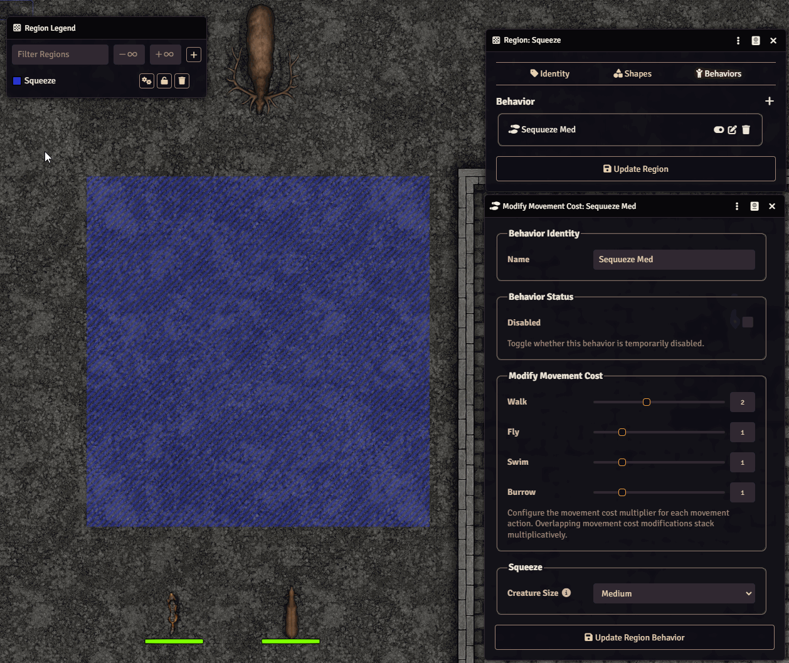

# Squeeze It

Squeeze It extends FoundryVTT Region behavior configuration for DnD5e by adding size-aware squeeze rules on top of Modify Movement Cost.

## What this module does

- Adds a new Squeeze group to Region Behavior config when editing a Modify Movement Cost behavior.
- Adds a Size selector with all DnD5e creature sizes plus All.
- Applies movement rules dynamically based on the selected squeeze size.

## Squeeze Size Rules

When Squeeze size is set to All:

- The configured movement multiplier works as normal for all creatures.

When Squeeze size is set to a specific size (Tiny, Small, Medium, Large, Huge, Gargantuan):

- Creatures smaller than the selected size: no squeeze penalty (effective movement modifier remains 1x).
- Creatures exactly the selected size: configured movement multiplier applies.
- Creatures larger than the selected size: movement is blocked (infinite cost).

### Limitations

- Currently, the squeeze applies to all speeds configured on the specific behavior. E.g. if you want to have a tight passage that's ok for a small crature to walk in (and medium would be squeezing through) - but logically a small creatire should have trouble **flying** through same passsage. To implement this, you'll need to create two separate behaviors for walking and flying speed separately.
- Works best if the **region** is aligned to grid square edges - otherwise entering the area may produce unintended results (e.g. first square in the region won't apply the modifier if the square is not fully within the region).
- Currently default Foundry behavior of "token can spill through the wall" for large creatires still applies.

## UI behavior

- Injects a Squeeze settings group in the Modify Movement Cost behavior sheet.
- Includes a compact Size selector.
- Includes an info tooltip with rule details, split into separate sections for All and Specific size.
- Persists the selected value on the RegionBehavior document flag:
	- flags.squeeze-it.squeezeCreatureSize

## Compatibility

- FoundryVTT: v13
- System: dnd5e (2014 rules, v1 compatible data shape)

## License

See the repository LICENSE file.
